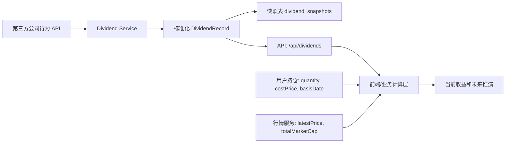

# Corporate Actions Reuse Guide

本文总结 A 股持仓工具中处理分红、送股、转增等公司行为的实现方式、注意事项和复用经验。目标是让其他项目可以复用同一套设计，而不绑定当前项目 UI、数据库或部署平台。

## 适用范围

适合以下场景：
- 用户保存了已有持仓，包含持仓数量、成本价和持仓基准日。
- 系统需要展示当前市值、浮动收益、收益率。
- 系统需要在历史分红、送股、转增造成股数和收益口径变化后，自动修正当前持仓结果。
- 项目可以接受公共数据源作为 MVP 起步，并通过服务层封装，未来替换成更稳定的商业数据源。

暂不建议自动处理：
- 配股、供股等需要用户额外付款或主动认购的行为。
- 用户历史多笔买入卖出、分批成本、税费、红利税等精细账本。
- 未来尚未实施或只有预案但无除权除息日的公司行为。

## 推荐架构

核心原则：数据源、标准化、持久化、计算、展示分层。



推荐边界：
- `dividend-service`: 负责第三方请求、字段标准化、缓存、快照兜底。
- `api/dividends`: 只暴露标准化后的公司行为数据，不暴露第三方原始字段。
- `positions`: 保存用户原始持仓和 `basisDate`，不要把调整后股数写回原始持仓。
- `calculation`: 使用标准化公司行为记录动态计算有效股数、累计现金分红、当前收益和目标市值推演。

## 数据源策略

本项目采用的 MVP 策略：
- 优先使用 Tushare Pro：配置 `TUSHARE_TOKEN` 后调用 `dividend` 接口。
- 无 token 或 Tushare 请求失败时，回退东方财富公开接口 `RPT_SHAREBONUS_DET`。
- 实时源成功后，将标准化结果写入 `dividend_snapshots`。
- 实时源失败时，优先读取最近成功快照。
- 如果快照也不可用，再返回空公司行为记录，让业务按原始持仓估算。

复用建议：
- 第三方 API 一律藏在服务层后面，不让 UI 或业务计算直接依赖供应商字段。
- 所有 provider 都转换到同一份 `DividendRecord`。
- 用 `Promise.allSettled` 按股票粒度容错，避免单只股票失败拖垮整批返回。
- 设置短超时和内存缓存，避免用户每次刷新都打第三方接口。
- 快照持久化失败不应阻断本次返回；快照是兜底能力，不是主链路硬依赖。
- HTTP 成功但 payload 结构异常、字段缺失或标准化后记录数为 0 时，不要当作 live 成功；应视为 provider 失败并优先使用上一份快照。
- 只有确认拿到了可信的标准化记录后才更新 `dividend_snapshots`，避免一次供应商接口改版把最后好数据覆盖为空。

## 标准化数据模型

建议把所有 provider 统一成以下结构：

```ts
interface DividendRecord {
  reportDate: string
  totalRatio: number | null
  sendRatio: number | null
  transferRatio: number | null
  cashDividendRatio: number | null
  cashDividendDescription: string
  recordDate: string
  exDate: string
  planProgress: string
  latestAnnouncementDate: string
}
```

字段口径：
- `sendRatio`: 每 10 股送多少股。
- `transferRatio`: 每 10 股转增多少股。
- `cashDividendRatio`: 每 10 股派多少元，税前口径优先。
- `recordDate`: 股权登记日。
- `exDate`: 除权除息日，计算是否应用公司行为时最关键。
- `planProgress`: 预案、股东大会通过、实施等状态。

数据库建议：

```ts
positions:
  user_id
  stock_code
  quantity
  cost_price
  basis_date

dividend_snapshots:
  stock_code primary key
  payload text/json
  source
  fetched_at
```

关键点：
- `basisDate` 是用户这笔持仓数据的起算日。
- 老数据迁移时可以让 `basisDate` 为空，并在读取时回退到 `updatedAt` 或当天。
- 快照表存标准化后的记录，不存第三方原始响应，后续换 provider 时更稳。
- 标准化数字时要区分 `null`、空字符串和真实的 `0`。未知值应保留为 `null`，不要用 `Number(null)` 把它误转成 0。
- 计算层再用 `?? 0` 处理缺失值，这样 API 语义更清楚：`null` 表示源没有给出，`0` 表示明确没有送股/转增/派息。

## 计算规则

输入：
- 原始股数 `quantity`
- 原始成本价 `costPrice`
- 持仓基准日 `basisDate`
- 最新价 `latestPrice`
- 已标准化公司行为记录 `records`

规则：
- 原始成本总额 = `quantity * costPrice`
- 只应用 `exDate > basisDate` 且 `exDate <= today` 的记录。
- 有 `planProgress` 时，只应用明确已实施的记录。
- 按 `exDate` 从早到晚排序。
- 每次公司行为使用当时调整前股数计算现金分红。
- 送股和转增共同调整有效股数。
- 配股不默认处理，因为它需要用户付款/认购，不能假设所有用户参与。
- 连续送转会触发浮点尾差，例如 `2000 * 1.4 * 1.4` 可能得到 `3919.9999999999995`；展示和后续计算前应做固定精度归一。

参考伪代码：

```ts
function adjustPosition(position, records) {
  let effectiveQuantity = position.quantity
  let cashDividendAmount = 0
  const originalCostAmount = position.quantity * position.costPrice
  const appliedActions = []

  for (const record of sortByExDateAsc(records)) {
    if (!record.exDate) continue
    if (record.exDate <= position.basisDate) continue
    if (record.exDate > today()) continue
    if (record.planProgress && !record.planProgress.includes('实施')) continue

    const beforeQuantity = effectiveQuantity
    const shareRatio = ((record.sendRatio ?? 0) + (record.transferRatio ?? 0)) / 10
    const cashRatio = (record.cashDividendRatio ?? 0) / 10

    cashDividendAmount = roundCalculatedValue(cashDividendAmount + beforeQuantity * cashRatio)
    effectiveQuantity = roundCalculatedValue(beforeQuantity * (1 + shareRatio))
    appliedActions.push(record)
  }

  const currentHoldingValue = effectiveQuantity * latestPrice
  const currentProfit = currentHoldingValue + cashDividendAmount - originalCostAmount
  const currentProfitRate = originalCostAmount > 0 ? currentProfit / originalCostAmount : 0

  return {
    effectiveQuantity,
    cashDividendAmount,
    originalCostAmount,
    currentHoldingValue,
    currentProfit,
    currentProfitRate,
    appliedActions,
  }
}

function roundCalculatedValue(value, precision = 6) {
  const scale = 10 ** precision
  return Math.round((value + Number.EPSILON) * scale) / scale
}
```

未来市值推演：
- 目标价 = `latestPrice * targetMarketCap / currentTotalMarketCap`
- 目标持仓市值 = `effectiveQuantity * targetPrice`
- 目标总收益 = `targetHoldingValue + cashDividendAmount - originalCostAmount`
- 从当前再增加收益 = `targetHoldingValue - currentHoldingValue`

## 持仓基准日的产品口径

`basisDate` 是这个方案最容易被误用的字段。

推荐解释：
- 如果用户输入的是买入当时的原始股数和成本价，`basisDate` 应该填买入日或这笔持仓开始日。
- 如果用户输入的是现在券商 App 中已经除权除息后的股数和成本价，`basisDate` 应该填今天或最近一次确认该持仓数据的日期。
- 如果基准日填得过早，而输入的股数已经是除权后股数，会重复应用送转。
- 如果基准日填得过晚，历史分红送转不会被计入收益。

老项目迁移建议：
- 新增 `basisDate` 时不要强行猜用户真实买入日。
- 先用 `updatedAt` 或当天作为默认值，保证不重复调整。
- UI 中提供可编辑的“持仓基准日”，让用户自己修正历史口径。

## API 设计建议

公司行为 API 返回结构建议：

```json
{
  "dividends": [
    {
      "code": "300502",
      "name": "新易盛",
      "label": "300502 新易盛",
      "records": []
    }
  ],
  "freshness": "live",
  "source": "Tushare Pro"
}
```

`freshness` 建议枚举：
- `live`: 全部来自实时源。
- `partial`: 部分实时、部分缓存或空值。
- `cached`: 全部来自快照缓存。
- `fallback`: 没有可用公司行为数据。

这样 UI 可以明确提示用户当前数据质量，而不是静默显示一个可能不完整的结果。

## 注意事项

- 不要只按公告日判断是否应用，计算应以除权除息日 `exDate` 为准。
- 没有 `exDate` 的预案不应进入持仓调整。
- 现金分红应按每次行为发生前的有效股数计算。
- 送股、转增会影响后续现金分红计算，所以必须按时间顺序应用。
- 同一 provider 的字段口径要仔细核对，特别是“每股”与“每 10 股”的单位差异。
- A 股常见展示是“10派X元、10送Y股、10转Z股”，内部最好也统一到每 10 股口径。
- Tushare `stk_bo_rate`、`stk_co_rate`、`cash_div_tax` 等字段通常是每股口径，转成统一模型时需要乘以 10；东方财富 `BONUS_RATIO`、`IT_RATIO`、`PRETAX_BONUS_RMB` 在当前接口样本中已是每 10 股口径。
- 金额计算建议保留 number 即可满足 MVP，但严肃账务系统应使用 decimal 库或数据库 numeric。
- 不要把调整后的股数覆盖用户原始持仓，否则无法解释用户输入口径，也难以重算。
- 第三方公共接口没有 SLA，应有快照、超时、错误兜底和可替换 provider。
- 不要提交 API token；只通过环境变量配置。
- 不要把“接口返回 200”当作数据可靠，必须校验数组结构、股票代码、日期字段和标准化后的记录数。

## 测试清单

基础计算：
- 无公司行为时，有效股数等于原始股数。
- 只有现金分红时，股数不变，累计现金分红增加。
- 只有送股/转增时，股数增加，现金分红不变。
- 多次公司行为时，后一次基于前一次调整后的股数计算。
- `exDate <= basisDate` 的记录不应用。
- `exDate > today` 的记录不应用。
- 无 `exDate` 的预案不应用。

真实数据 smoke test：
- 选一只有已实施送转和派息记录的股票。
- 将 `basisDate` 设在除权除息日前，确认有效股数和现金分红变化。
- 将 `basisDate` 设在除权除息日当天或之后，确认该记录不再重复应用。
- 断开实时源或故意让 provider 失败，确认会使用快照。
- 清空快照后再失败，确认系统返回空记录且 UI 有提示。
- 增加“HTTP 200 但 data 为空或结构变化”的模拟测试，确认不会覆盖最后好快照。
- 增加连续送转样例，确认股数不会出现肉眼可见的浮点尾差。
- 本项目最新样本可作为回归锚点：`300502` 最新已实施记录为 `2026-06-11`，`10转4股派10.00元`；`300308` 最新预披露记录无 `exDate`，不应被应用。

接口和部署：
- 未配置 token 时，应能走公共 fallback。
- 配置 token 后，应优先显示商业源或主 provider source。
- 数据库不可用时，行情/公司行为读取不应因为快照写入失败而整体崩掉。
- API 返回应包含 `freshness` 和 `source`，便于排查线上问题。

## 复用到其他项目的落地步骤

1. 先抽象股票列表和股票代码校验，例如 `STOCKS`、`isStockCode`、`getStockByCode`。
2. 新增标准化公司行为类型 `DividendRecord`。
3. 新增 provider service，先实现一个可靠源，再加公共 fallback。
4. 新增 `dividend_snapshots`，保存标准化 records。
5. 新增 `/api/dividends`，只返回标准化后的 records、freshness、source。
6. 给持仓表增加 `basisDate`。
7. 在读取老持仓时为缺失 `basisDate` 提供安全默认值。
8. 在前端或业务服务层实现 `adjustPositionForCorporateActions`。
9. 当前收益、收益率、未来推演全部改用有效股数和累计现金分红。
10. UI 增加数据质量提示和持仓基准日编辑入口。
11. 用真实历史公司行为做 smoke test。

## 本项目沉淀出的经验

- 公司行为不是行情字段的补充，而是一条独立数据链路，需要自己的 provider、缓存和质量状态。
- “已有持仓是否已经除权后录入”无法靠系统猜准，必须让持仓带 `basisDate`。
- 最安全的迁移策略是默认不追溯调整老持仓，除非用户把基准日改到历史日期。
- 业务计算应始终保留原始成本和原始股数，再派生有效股数和现金分红。
- 公共数据源适合 MVP 验证，但要一开始就包在项目自己的服务层里。
- 快照兜底比硬编码 fallback 更有价值，因为它保留的是项目曾经真实拿到过的数据。
- source/freshness 是线上排障必需字段，建议从第一版 API 就带上。
- 权益类行为里，派息、送股、转增可自动应用；配股/供股需要用户动作，默认不自动应用更符合真实账户逻辑。
- 最后好快照要防止被空 live 响应污染。供应商改版、风控或临时异常时，最危险的不是报错，而是返回“看似成功但没有有效记录”的数据。
- API 层保留 `null` 比提前归零更利于排障；计算层可以把缺失字段按 0 处理，但不要丢掉源数据到底是“未知”还是“明确为 0”的差别。
- 真实样本验证要同时覆盖“已实施记录”和“未实施/无除权日记录”，否则很容易只验证了会加收益，却漏掉了不该应用的预案。
